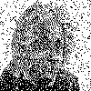
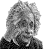

# Hopfield Network - Associative Memory Implementation

This repository contains a from-scratch implementation of a **Hopfield Network**, a type of recurrent artificial neural network that serves as a form of associative memory.
The network is capable of storing and retrieving patterns, making it useful for pattern recognition and completion tasks.

## Table of Contents
- [Introduction](#introduction)
- [Features](#features)
- [Usage](#usage)
- [Examples](#examples)

## Introduction
A **Hopfield Network** is a fully connected auto-associative neural network proposed by John Hopfield in 1982. It can store one or more patterns and retrieve them even
when presented with noisy or incomplete versions. This implementation demonstrates how the network learns patterns and recalls them based on associative memory principles.

## Features
- **From-scratch implementation** in Python (NumPy-based).
- **Training and recall** of binary patterns.
- **Noise resistance**: Retrieve stored patterns from corrupted inputs.
- **Energy function visualization** to observe network convergence.
- **Customizable network size** for different pattern dimensions.

## Usage
- First, we include the necessary modules and classes
```python
from Hopfield import HopfieldNet
from process import process_image, noise, delete_image
import matplotlib.image
import numpy as np
``` 
- We create a list to store the images we want our network to learn and another list to store the processed images. Then, we process our images to a desire size in order to
  reduce the calculations. Introduce your images inside fnames (no more than 3-4, because this neural network has low capacity).
```pyhton
fnames = [fname1.png, fname2.jpg]
patterns = []
size=[100,100]

for fname in fnames:
    patterns.append(process_image(fname,size))
```
- Then, we initialize the neural network and calculate the weight matrix using ours patters that were first processed
```python
hopfield = HopfieldNet(size)
hopfield.train(patterns)
```
- After this, we can use two fuctions from *process.py*, *noise()* and *delete()* to manipulate our images (see this file to see what this fuctions do). For example, lets use
the first function in order to introduce some random noise, as its name implies.
```python
init_state = noise(fname1.png, p=0.1)
```
- And finally, we update the state in a \# of steps (*nstep*) and use the #sign function# as the activation function.
```python
final_state = hopfield.update_slow(init_state, nsteps, f_activation=np.sign, n=0.1)
```

## Example
Here you have the init state you get after you process the image (left) and the final state you get after 100 steps.
<div style="display: flex; justify-content: space-between;">
  
  
</div>
